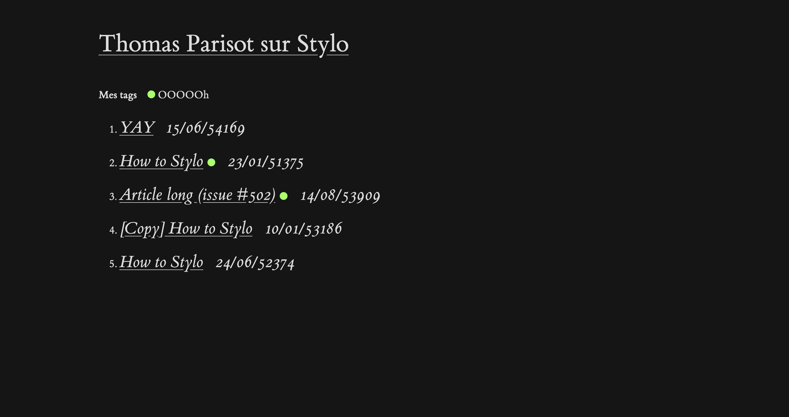

# 11ty-stylo

Carnet web propulsé par Eleventy, et des données hébergées sur Stylo



## Installer

```
npm install
```

## Configurer

1. Copier le fichier `.env.example` en `.env`
2. Ajouter la clé d'API de votre compte Stylo

## Démarrer

```
npm start
```
